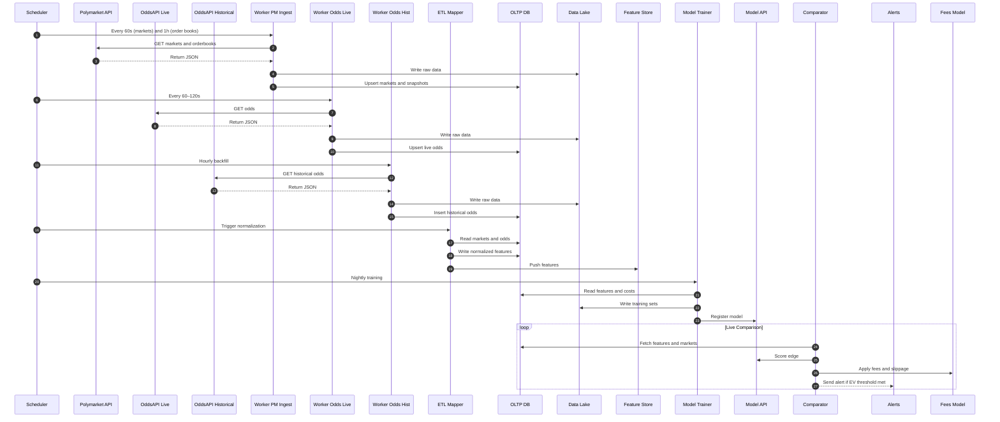

# Polymarket + Sportsbook Edge Detection Architecture

This system continuously ingests live and historical data from Polymarket and TheOddsAPI, stores hourly snapshots, converts Polymarket data into sportsbook-compatible structures, and eventually trains an ML model to confirm whether Polymarket offers a superior price after accounting for fees and slippage.

---

## 🧩 Overview

**Goal:** Identify and verify consistent pricing edges where Polymarket markets outperform traditional sportsbooks — first via direct comparison, later via a trained model built from months of historical data.

---

## 🧱 System Architecture

```mermaid
flowchart LR
  subgraph SRC[Data Sources]
    PM[Polymarket Markets and Order Books]
    OA[TheOddsAPI Sportsbook Lines (live)]
    OAH[TheOddsAPI Historical Lines]
  end

  subgraph ORCH[Orchestration & Workers]
    AF[Scheduler / Orchestrator (Airflow or Celery)]
    W1[Ingest Worker: Polymarket]
    W2[Ingest Worker: OddsAPI Live]
    W3[Ingest Worker: OddsAPI Historical]
    W4[ETL & Schema Mapper (PM to Sportsbook layout)]
    W5[Feature Builder]
    W6[Model Trainer]
    W7[Comparator & Signals]
  end

  subgraph STG[Storage]
    subgraph OLTP[Operational DB (Postgres or Timescale)]
      DBM[markets]
      DBOB[order_books_hourly_snapshots]
      DBOAL[oddsapi_live]
      DBOAH[oddsapi_historical_hourly]
      MAP[market_mappings and team_aliases]
      FEAT[features_latest]
      SIG[signals]
      EXEC[executions and fills]
      COST[cost_models and fee_tables]
    end
    subgraph DL[Data Lake (S3 or GCS)]
      RAW[raw parquet data (pm, oddsapi, snapshots)]
      TRAIN[ml training sets]
      MODELS[ml models and metrics]
    end
    FS[Feature Store (DuckDB or Feast)]
  end

  subgraph SVC[Serving & Ops]
    API[Model and Comparator API]
    UI[Ops UI / Dashboards (Streamlit or Grafana)]
    ALERT[Alerting (Slack or Email)]
    BOT[Trader Bot (optional)]
    MON[Monitoring and Logs (Prometheus or ELK)]
  end

  PM -->|markets poll| W1
  PM -->|order book 1h snapshot| W1
  OA -->|live odds poll| W2
  OAH -->|hourly backfill| W3

  W1 --> RAW
  W1 --> DBM
  W1 --> DBOB
  W2 --> RAW
  W2 --> DBOAL
  W3 --> RAW
  W3 --> DBOAH

  DBM --> W4
  DBOB --> W4
  MAP --> W4
  W4 --> FEAT
  W4 --> FS

  FEAT --> W5
  DBOAH --> W5
  DBOAL --> W5
  W5 --> FS
  W5 --> TRAIN

  TRAIN --> W6
  COST --> W6
  W6 --> MODELS
  W6 --> API

  API --> W7
  FS --> W7
  DBOAL --> W7
  DBM --> W7
  COST --> W7
  W7 --> SIG
  W7 --> ALERT
  W7 --> UI

  SIG --> BOT
  BOT --> EXEC
  EXEC --> UI

  ORCH --> MON
  STG --> MON
  SVC --> MON
```

⸻

## 🔁 Dataflow / Handshakes

⸻

## ⏱ Scheduling & Cadence

```mermaid
gantt
  dateFormat  HH:mm
  title Ingestion and Pipeline Cadence
  section Polymarket
  Markets poll (30–60s)        :done, pm1, 00:00, 00:05
  Order book snapshot (1h)      :active, pm2, 00:00, 01:00
  section OddsAPI
  Live odds poll (60–120s)      :active, oa1, 00:00, 00:10
  Historical backfill (hourly)  :active, oa2, 00:05, 00:30
  section ETL
  Normalize + map entities (5m) :etl1, 00:02, 00:07
  Feature build (rolling)       :etl2, 00:07, 00:12
  section Modeling
  Nightly train/eval            :mt1, 23:00, 01:00
  section Compare & Signals
  Edge calc (rolling 1–2m)      :cmp1, 00:00, 00:10
```



⸻

## 🧠 Implementation Notes
	- Entity mapping: map team and event IDs to align Polymarket vs sportsbook.
	- Cost model: store fees, slippage, fill probabilities, and minimum liquidity.
	- Snapshots: hourly order books and historical odds to study trends.
	- Features: price deltas, drift, volatility, mean reversion.
	- Model: after 2–3 months, train a classifier + regression combo to confirm edges.
	- Comparator: trigger only when model and Polymarket both show edge after costs.
	- Monitoring: Grafana + Prometheus for data freshness and failures, Slack alerts for new edge detections.

⸻

## 🧩 Tech Stack Summary

Layer	Tools
Ingestion	Python (Celery / Airflow)
Storage	PostgreSQL + Timescale, S3
Processing	Pandas / Polars / DuckDB
Modeling	scikit-learn / XGBoost
API	FastAPI
UI	Streamlit / Next.js
Monitoring	Prometheus + Grafana
Alerts	Slack / Email
