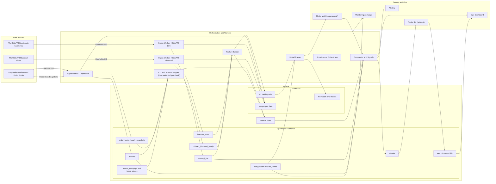

# Polymarket + Sportsbook Edge Detection Architecture

This system continuously ingests live and historical data from Polymarket and TheOddsAPI, stores hourly snapshots, converts Polymarket data into sportsbook-compatible structures, and eventually trains an ML model to confirm whether Polymarket offers a superior price after accounting for fees and slippage.

---

## 🧩 Overview

**Goal:** Identify and verify consistent pricing edges where Polymarket markets outperform traditional sportsbooks — first via direct comparison, later via a trained model built from months of historical data.

---

## 🧱 System Architecture

⸻

## 🔁 Dataflow / Handshakes

⸻

## ⏱ Scheduling & Cadence

⸻

## 🧠 Implementation Notes
	- Entity mapping: map team and event IDs to align Polymarket vs sportsbook.
	- Cost model: store fees, slippage, fill probabilities, and minimum liquidity.
	- Snapshots: hourly order books and historical odds to study trends.
	- Features: price deltas, drift, volatility, mean reversion.
	- Model: after 2–3 months, train a classifier + regression combo to confirm edges.
	- Comparator: trigger only when model and Polymarket both show edge after costs.
	- Monitoring: Grafana + Prometheus for data freshness and failures, Slack alerts for new edge detections.

⸻

## 🧩 Tech Stack Summary

Layer	Tools
Ingestion	Python (Celery / Airflow)
Storage	PostgreSQL + Timescale, S3
Processing	Pandas / Polars / DuckDB
Modeling	scikit-learn / XGBoost
API	FastAPI
UI	Streamlit / Next.js
Monitoring	Prometheus + Grafana
Alerts	Slack / Email
